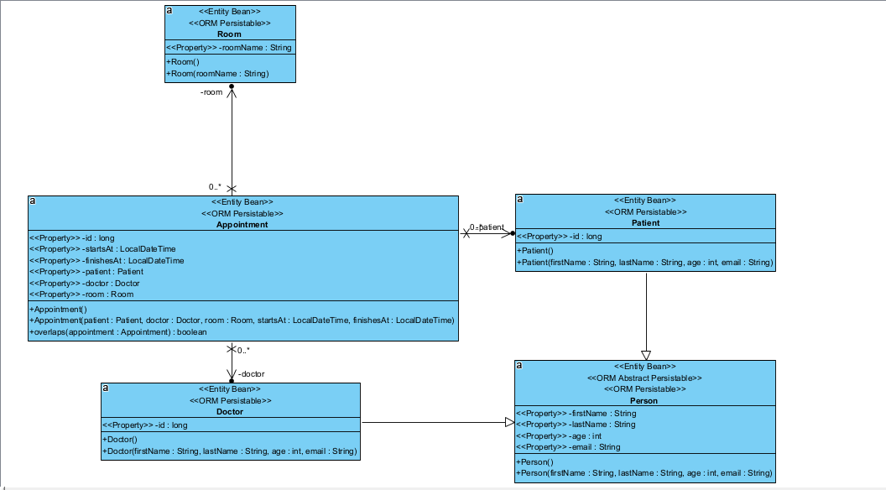

# AccWe hospital

## Solution for Accenture's Java Back End Developer Challenge

To build and run the Docker image, use the following commands:
    
    1. Build the MySQL Docker image
    ```bash
    docker build -t my-mysql -f Dockerfile.mysql .
    ```
    2. Run the MySQL Docker image
    ```bash
    docker run -d -p 3306:3306 --name my-running-mysql my-mysql
    ```
    3. Build the Maven Docker image (runs the tests and compiles the application)
    ```bash
    docker build -t hospital-app -f Dockerfile.maven .
    ```
    4. When the tests pass, run the Maven Docker image
    ```bash
    docker run -d -p 8080:8080 --name running-hospital hospital-app
    ```

## UML Diagram of the entities

